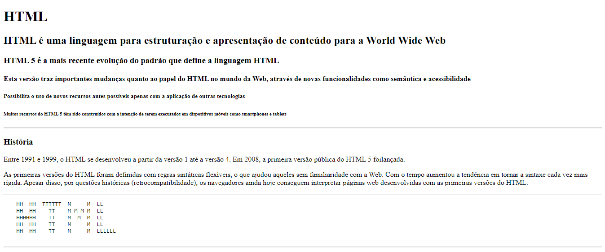
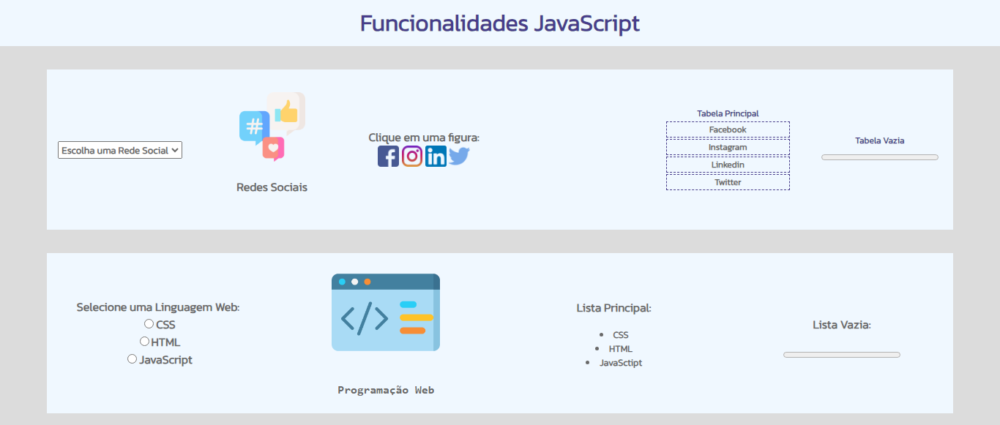
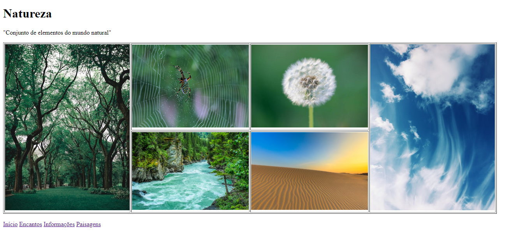
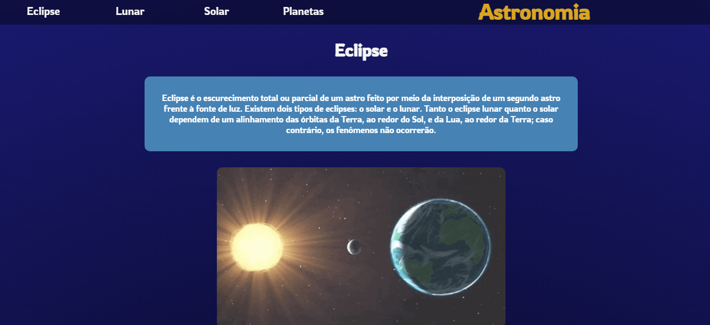
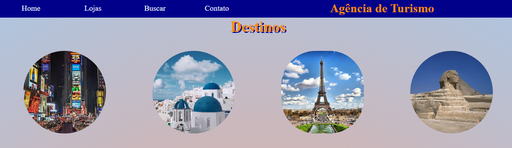
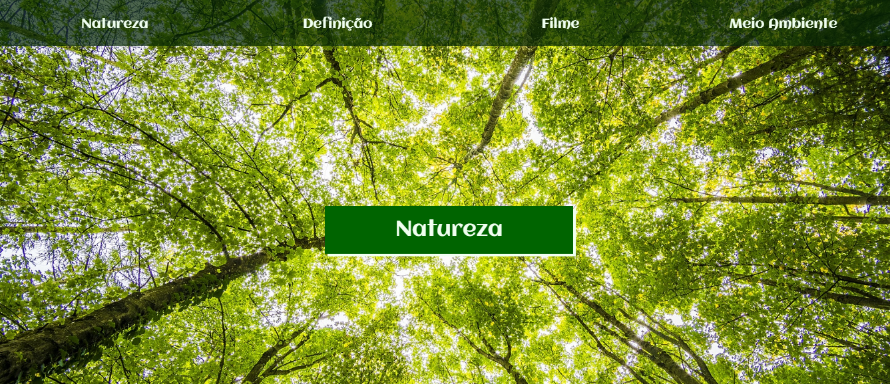
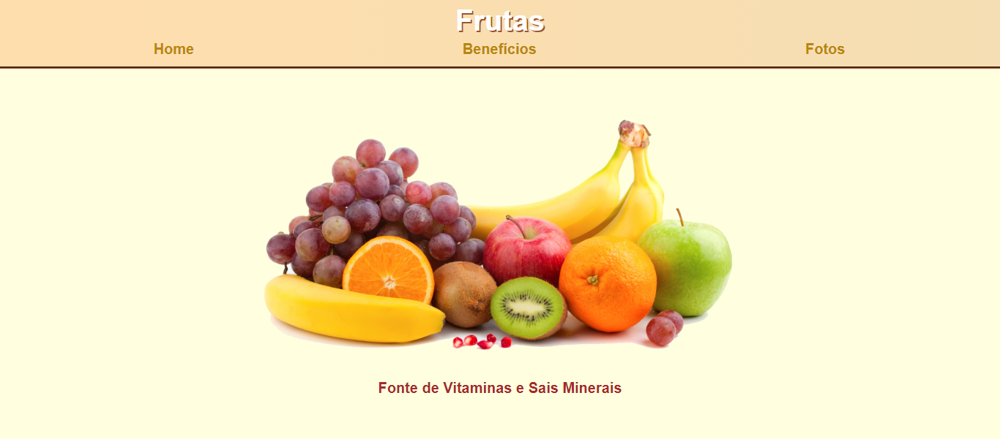
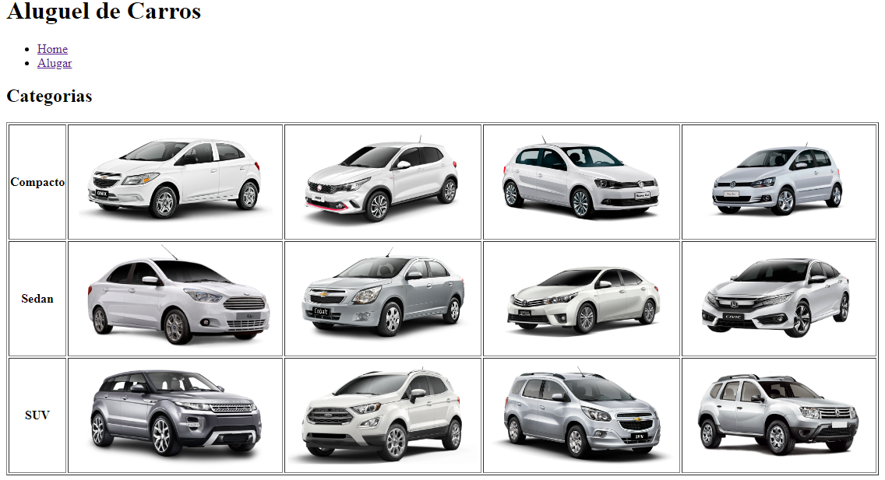
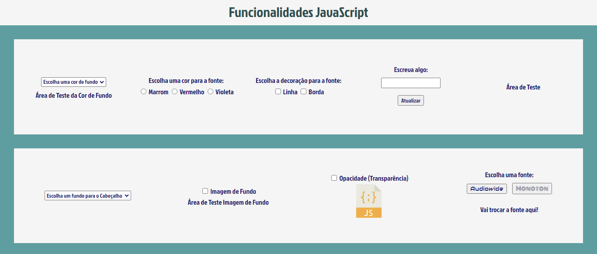
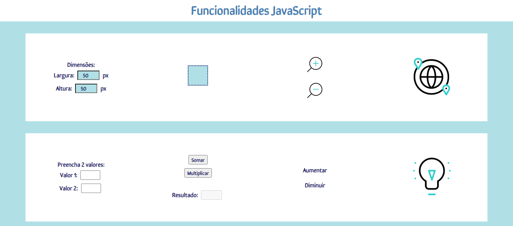

# Sites - Desenvolvimento Front-End

Olá! 👋

Este repositório traz consigo todos os projetos feitos em sala de aula na matéria Desenvolvimento Front-End do IFSP (Instituto Federal de São Paulo).

## Linguagens utilizadas

**Front-end:** HTML, CSS, JavaScript

## Funcionalidades

Nos últimos sites, utilizando de JavaScript, algumas funcionalidades foram atribuidas, como: 

- Troca da cor de fundo de um texto;
- Opacidade;
- Troca de fonte;
- Troca de imagens;
- Cálculos de áreas e perimetros.

## Screenshots

**1º site**

**2º site**

**3º site**

**4º site**

**5º site**

**6º site**

**7º site**

**8º site**

**9º site**

**10º site**

**11º site**

## Demonstração

**1º site**

**2º site**

**3º site**

**4º site**

**5º site**

**6º site**

**7º site**

**8º site**

**9º site**

**10º site**

**11º site**

## Link

Clique <a href="https://pedrolauton.github.io/ifsp-desenv-front-end/">aqui</a> para abrir os sites! 
